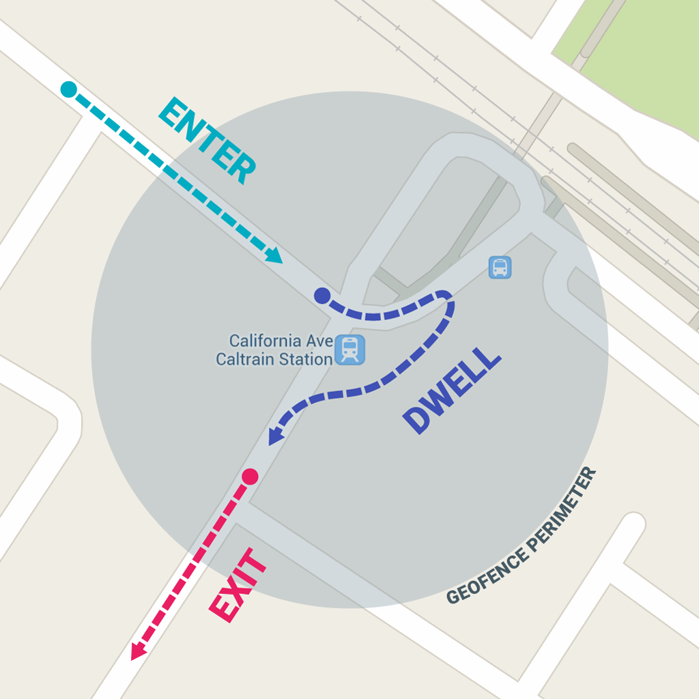
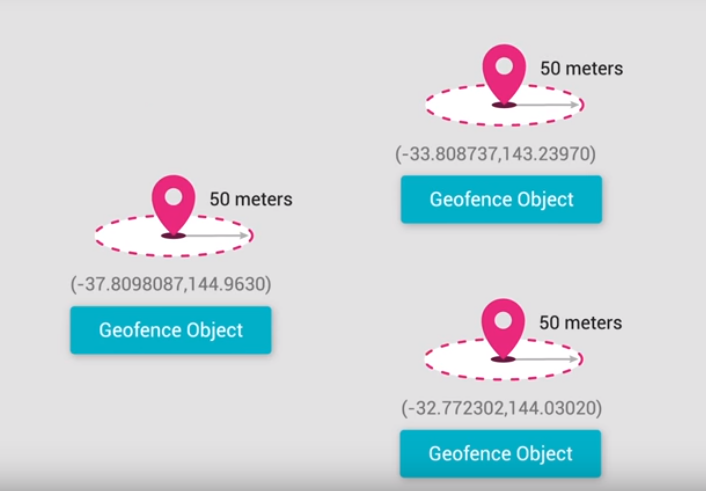
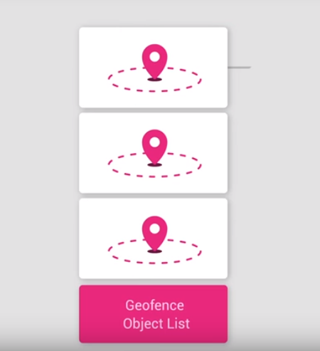
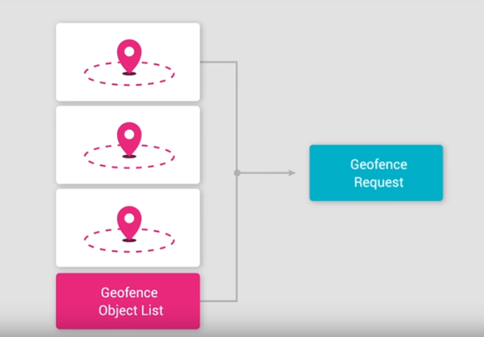
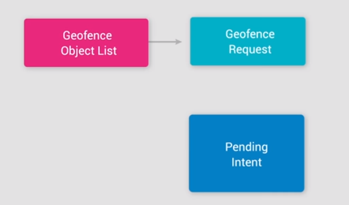
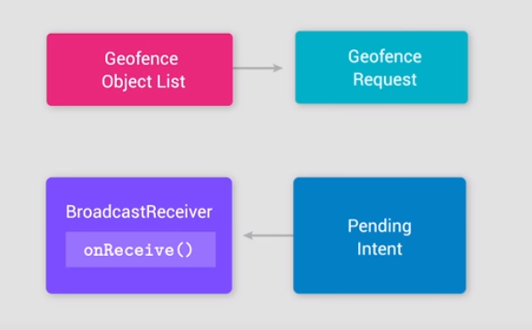
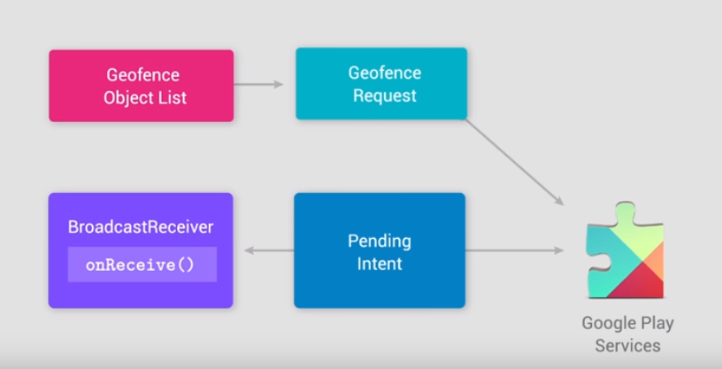
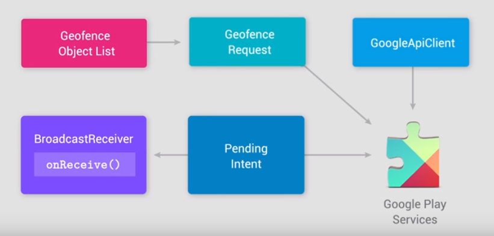

# Defining the Geofences

Geofencing combines awareness of the user's current location with awareness of the user's proximity to locations that may be of interest. To mark a location of interest, you specify its latitude and longitude. To adjust the proximity for the location, you add a radius. The latitude, longitude, and radius define a geofence, creating a circular area, or fence, around the location of interest.

You can have multiple active geofences, with a limit of **100** per device user. For each geofence, you can ask Location Services to send you entrance and exit events, or you can specify a duration within the geofence area to wait, or dwell, before triggering an event. You can limit the duration of any geofence by specifying an expiration duration in milliseconds. After the geofence expires, Location Services automatically removes it.



## Considerations

Geofences are not adecuated for GPS pooling and the device could take a couple of minutes in realized it has entered in Geofence.


## Overview

1. Build Geofences objects (lat, long and radius)

    

2. Store all the geofences in a list.

    


3. Register the geofences by creating Geofence request object with the list of geofences from above

    

4. Define a pending intent to specify which intent to launch when the geofence entry or exit envent trigger

    

5. Use a broadcast receiver in the Pending Intent. Whenever the device enters or exist any of the geofences, the onReceive method in the broadcast receiver will run (the logic will be implemented there)

    

6. Register the geofences by passing the Geofence Request and the pending intent objects

    

7. Add in the Google API client

    


## Implemantation


1. Ensure the  ```ACCESS_FINE_LOCATION```permission was granted

```xml
    <uses-permission android:name="android.permission.ACCESS_FINE_LOCATION"/>
```

2. Create a ```Geofencing``` class

```java
        public class Geofencing {
            private GoogleApiClient mGoogleApiClient;
            private Context mContext;
            private List<Geofence> mGeofenceList;
            private PendingIntent mGeofencePendingIntent;


            public Geofencing(Context context, GoogleApiClient client) {
                this.mGoogleApiClient = client;
                this.mContext = context;
                this.mGeofenceList = new ArrayList<>();
                this.mGeofencePendingIntent = null;
            }


            ....

        }
```

3. Implement a update geofences list, which retrievee a place buffer and convert fills the mGeofenceList ArrayList

 ```java
        public class Geofencing {

                ...


         /**
             * Updates the local ArrayList of Geofences using data from the passed in List
             * Uses the Place ID defined by the API as the Geofence object id
             * @param places the PlaceBuffer result of the getPlaceById call
             */
            public void updateGeofenceList (PlaceBuffer places){
                mGeofenceList = new ArrayList<>();
                if (places == null || places.getCount() == 0){
                    return;
                }

                for (Place place : places){

                    // Read the place information from the DB Cursor
                    String placeUID = place.getId();
                    double placeLat = place.getLatLng().latitude;
                    double placeLng = place.getLatLng().longitude;

                    //Build a Geofence object
                    Geofence geofence = new Geofence.Builder()
                            .setRequestId(placeUID)
                            .setExpirationDuration(GEOFENCE_TIMEOUT)
                            .setCircularRegion(placeLat, placeLng, GEOFENCE_RADIUS)
                            .setTransitionTypes(Geofence.GEOFENCE_TRANSITION_ENTER | Geofence.GEOFENCE_TRANSITION_EXIT)
                            .build();

                    // Add it to the List
                    mGeofenceList.add(geofence);
                }
            }


                ...
 ```


## References

[Creating and Monitoring GeoFences](https://developer.android.com/training/location/geofencing.html)

[Google APIs for Android Geofences](https://developers.google.com/android/reference/com/google/android/gms/location/Geofence)


