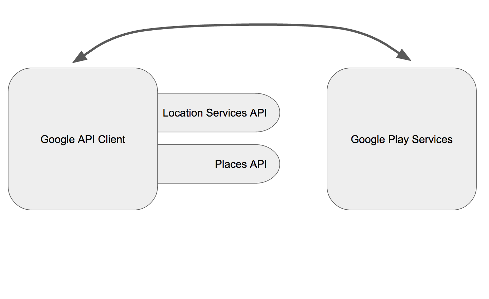

# Google API Client

Some Google Play Services APIs require you to create a client that will connect to Google Play Services and use that connection to communicate with the APIs



In our case, both places API and location services API require that client, so how do we create one? A Google API Client is created using ```GoogleApiClient.Builder``` as follows:

``` java
        GoogleApiClient client = new GoogleApiClient.Builder(this)
                    .addConnectionCallbacks(this)
                    .addOnConnectionFailedListener(this)
                    .addApi(LocationServices.API)
                    .addApi(Places.GEO_DATA_API)
                    .enableAutoManage(this,this)
                    .build();
```

First 2 methods, ```addConnectionCallbacks``` and ```addOnConnectionFailedListener```, are setting the callbacks that will notify when a connection is successful, since we will be creating this client in ```MainActivity```, we will set the callbacks to this. ```addApi``` is then called to add the API libraries we are planning to use, as we mentioned earlier we will be using the location services api and the places api. ```enableAutoManage``` means that the client will connect/disconnect on its own, otherwise you will have to call connect and disconnect explicitly. And then finally build creates the actual client object.

Now, since we’ve chosen to set this (```MainActivity```) as our callback listener, we need to implement a couple of interfaces:

```java
        public class MainActivity extends AppCompatActivity implements
            GoogleApiClient.ConnectionCallbacks,
            GoogleApiClient.OnConnectionsFailedListner,
            LoaderManager.LoaderCallbacks <Cursor> {

```

And hence implement the required methods:

```java
        @Override
        public void onConnected(@Nullable Bundle bundle) {
            Log.i (TAG,"API Client Connection Successful!");
        }
```

```java
        @Override
        public void onConnectionSuspended(int i) {
            Log.i (TAG,"API Client Connection Suspended!");
        }
```

```java
        @Override
        public void onConnectionFailed(@NonNull ConnectionResult connectionResult) {
            Log.i (TAG,"API Client Connection Failed!");
        }
```

Once the client automatically connects to Google Play Services, ```onConnected``` method will fire, that is if the connections was successful.

If for any reason it wasn’t, ```onConnectionFailed``` will fire instead.

```onConnectionSuspended``` as the name suggests fires when the client’s AutoManager decided to suspend the connection.