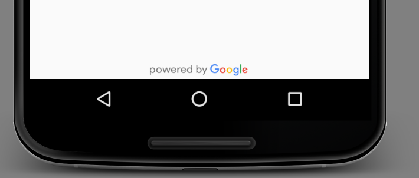
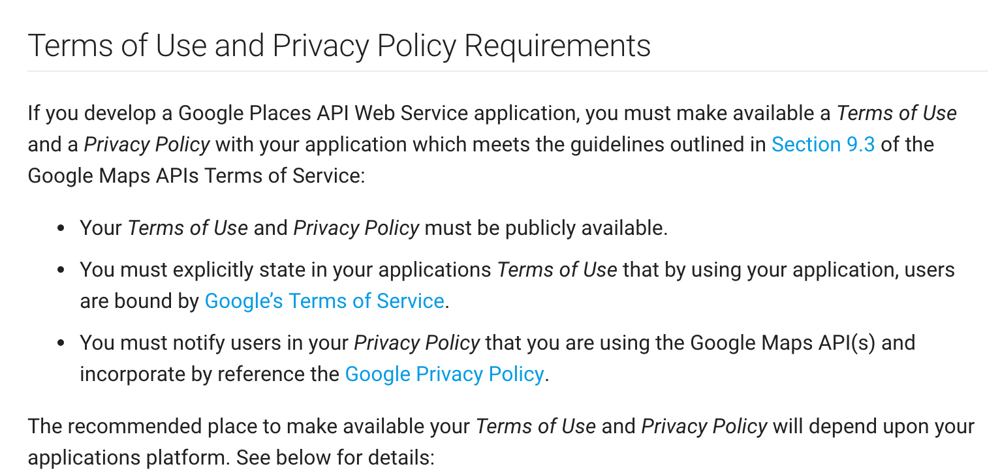

## Privacy and Attributions

 it’s important to note that Google requires any developer to follow certain rules when using their APIs: https://developers.google.com/places/web-service/policies


 When using any API, you should make a habit of familiarizing yourself with the terms and conditions that accompany it, as for the Places API, I’ve linked the policy page in the instructor notes below. We’ve already mentioned the restriction on caching places information locally for longer than 30 days. Another important part of the Places API policies is to attribute any information obtained from that API to Google This is achieved by displaying the “Powered by google” logo in any screen that displays information obtained by the places API which of course includes the list we just created.



The Places library bundles 2 versions of those logos for you to use directly without any modification, a light version and a dark version based on your background.

## Terms of Service
You might also be wondering why are we requesting the places information from the server everytime we want to display them in the recycler view! After all the place address and name shouldn't really change that frequently, can't we just store those details in the database and display that instead?

Well, according to [this section](https://developers.google.com/maps/terms#section_10_5) in the Terms of Service, you are not allowed to cache any data from those Places API for more than 30 days, as well as other limitations on how to store them. You can of course still cache them for when say the internet connection is lost and you would rather display the list than nothing at all, however, to comply with the terms, you will have to rebuild the database every 30 days and make sure all other constraints are met

Another requirement when using the Places API (or any Google Map related API for that matter) is to make available a **Terms of Use** and a **Privacy Policy** with your application which meets the guidelines outlined [here](https://developers.google.com/places/web-service/policies)



You should always make sure the Terms of Use and Privacy Policy are available in the Play Store so that when users download the application they understand the conditions they are implicitly agreeing upon. You can also include these terms somewhere inside the application itself (e.g in an About page that can be reached through a Settings menu, etc.).

Make sure, as part of this exercise, to include the powered by Google logo and a link to the privacy policy at the bottom of the screen.


## Set the powered by google Logo

```xml
         <ImageView
                    android:layout_width="wrap_content"
                    android:layout_height="wrap_content"
                    android:layout_gravity="center"
                    android:padding="4dp"
                    android:src="@drawable/powered_by_google_light" />
```


## References

[Google Maps APIs Terms of Services](https://developers.google.com/maps/terms)

[Places API Policies](https://developers.google.com/places/web-service/policies)