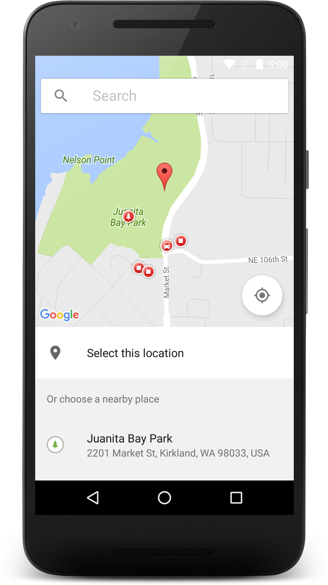

# Place picker

The place picker is a simple and yet flexible built-in UI widget, part of the Google Places API for Android.

## Introducing the place picker




The [PlacePicker](https://developers.google.com/android/reference/com/google/android/gms/location/places/ui/PlacePicker) provides a UI dialog that displays an interactive map and a list of nearby places, including places corresponding to geographical addresses and local businesses. Users can choose a place, and your app can then retrieve the details of the selected place.

The place picker provides the following advantages over developing your own UI widget:

1. The user experience is consistent with other apps using the place picker, including Google apps and third parties. This means users of your app already know how to interact with the place picker.

2. The map is integrated into the place picker.
3. Accessibility is built in.
4. It saves development time.

The place picker features autocomplete functionality, which displays place predictions based on user search input. This functionality is present in all place picker integrations, so you don't need to do anything extra to enable autocomplete. For more information about autocomplete, see [Place Autocomplete](https://developers.google.com/places/android-api/autocomplete).


To launch the place picker interface it is needed to set an intent which stars a new activity  

```java
        PlacePicker.IntentBuilder builder = new Placepicker.IntentBuilder();
        Intent i=builder.build (this);
        startActivityForResult (i, PLACE_PICKER_REQUEST);
```  

The ```startActivityForResult``` method 


## References
[Google Place API](https://developers.google.com/places/android-api/placepicker)